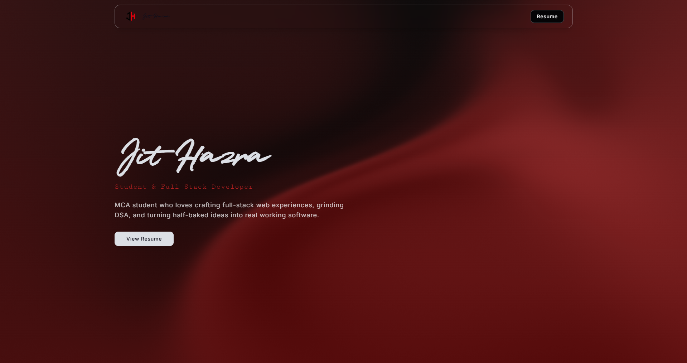

<div align="center">


# Jit Hazra

[](https://jithazra.vercel.app)
[](https://linkedin.com/in/jit-hazra)
[](https://github.com/Jit-codes-ez)

> *MCA Student · Full Stack Developer*

</div>

---



---

## ⚡ Built With

<div align="center">


</div>

---

## 🗂️ Sections

| Section | Description |
|---|---|
| 🏠 **Hero** | Introduction and role titles |
| 👤 **About** | Background and story |
| 🛠️ **Skills** | Tech stack and tools |
| 🚀 **Projects** | Featured work |
| 🎓 **Qualifications** | Education and achievements |
| 📬 **Contact** | Get in touch + resume |

---

## 🎨 Design

```
Theme      →  Dark red glassmorphism
Font       →  Nasalization · Inter · Quentine
Animation  →  Framer Motion
Background →  MeshGradient shader
```

---

## 📊 Stats

<div align="center">


</div>

---

## 📬 Contact

<div align="center">

| | |
|---|---|
| 📧 Email | jithazra.professional@gmail.com |
| 💼 LinkedIn | [linkedin.com/in/jit-hazra](https://linkedin.com/in/jit-hazra) |
| 🐙 GitHub | [github.com/Jit-codes-ez](https://github.com/Jit-codes-ez) |

</div>

---

<div align="center">

*Designed & built by* **Jit Hazra**

[](https://jithazra.vercel.app)

</div>